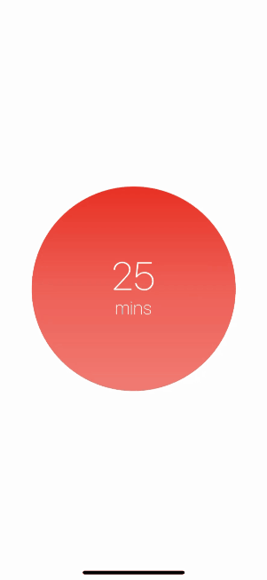
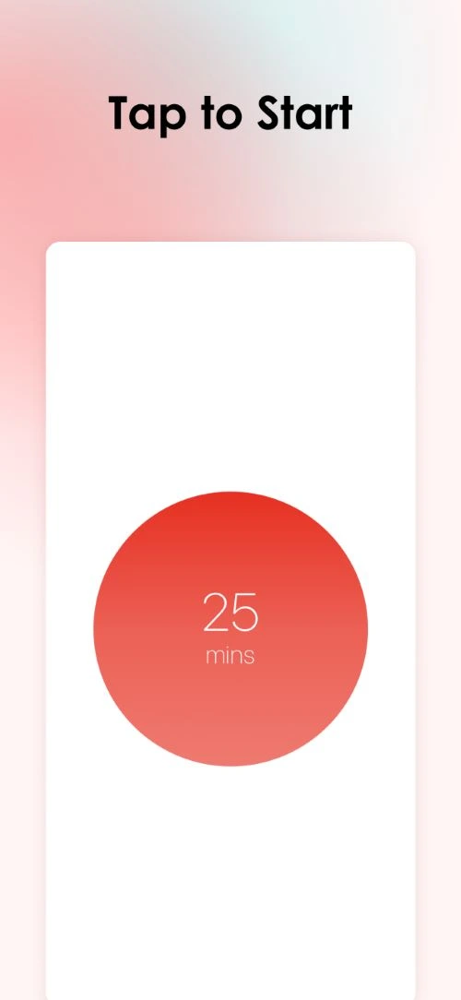
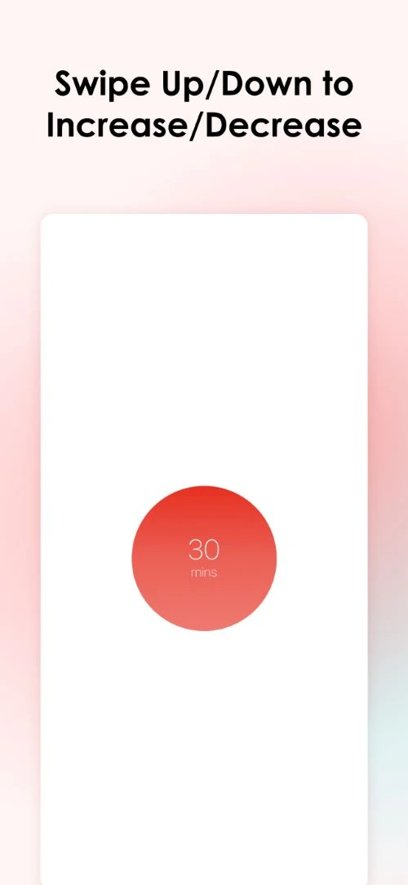
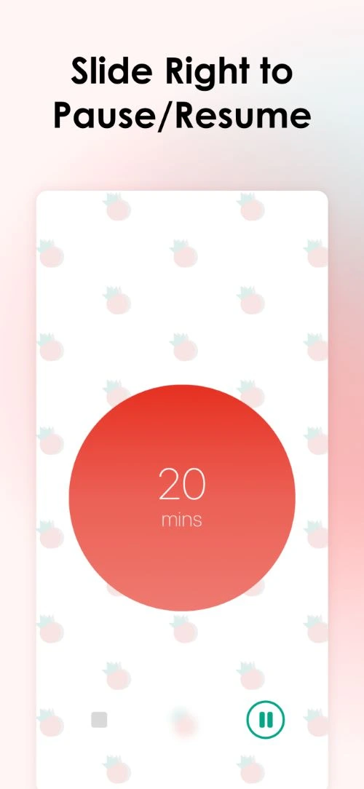
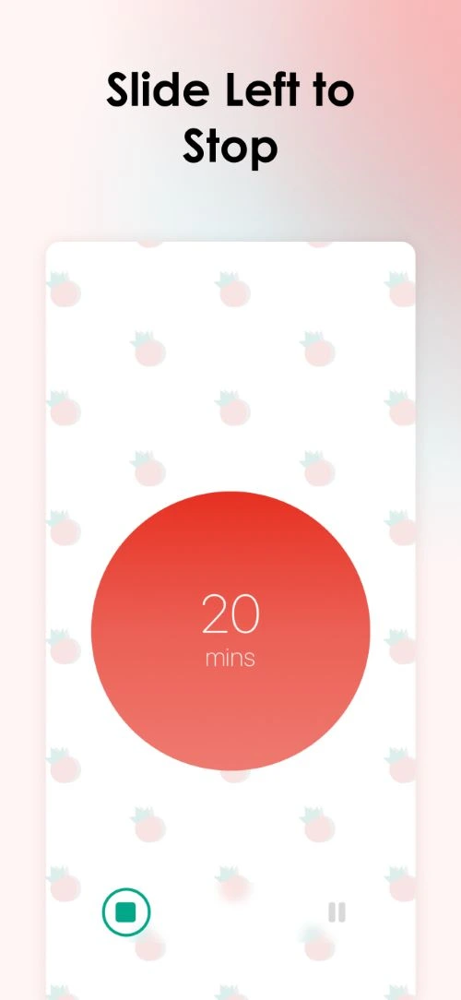
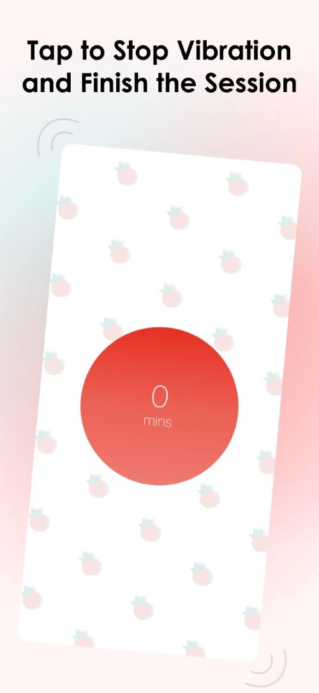

<h1>Little Tomato Support</h1>

 

This is the support site for little tomato.

## Features

All features available in latest version

- Start a standard pomodoro session - 25 minutes
- Customize session length
- Pause/resume the session
- Stop the session
- If app is in foreground, when session ends, app will keep vibrating before user taps it
- If app is in background, when session ends, app will send a notification as a reminder
- 7 Themes to choose from
- Random mode will randomly choose a different theme after each session
- Keep screen on feature
- Tutorial page

## Video Tutorial

## Image Tutorial

## How to Use Little Tomato?

### Start a session

Tap on the red circle to start a standard pomodoro session.  
Tap and hold and swipe up/down to increase/decrease the time and release to start a customized pomodoro session.

### Pause/resume a session

Slide the green circle to right to pause/resume the session.

### Stop a session

Slide the green circle to left to stop the session.

### Finish a session when it ends

If the app is in foreground, the app will keep vibrating along with the animation to indicate the session is over. Please tap on the red circle to complete the session.
If the app is in background, the app will send a notification to remind the user. When the app is open, it will do the same as described above, please tap on the red circle to complete the session.

## FAQs

### Why the app does not send notification when it is in background and the session is over?

For current version, Little Tomato is using Apple's and Google's own notification services, so for smart phones that use neither of them, Little Tomato might fail to send notifications.

We are working on supporting more notification services (e.g., Xiaomi, OPPO, Vivo, Honor, Huawei, etc.), but if you would like to receive notification in current version using one of the smart phones, please consider allowing the app to auto start and lock the app, so it won't be killed by operating system when the pomodoro session is running.

However, this issue should only exist on the smart phones that are using China mainland OS versions. Therefore, the ones that use a global OS version should still be able to receive notification.

### Is there an Android version?

Yes, Android version is developed in parallel with iOS version. But, as Google requires 20 testers to test the app for 14 days to release the app, so we are still looking for testers for Android version. If you would like to be a tester, please contact us at zero2anything@outlook.com. It's not a strict test process, just need to use the app for 14 days.

### How to submit a bug or suggestion?

Before you create a new issue, please search the existing issue list to avoid creating a duplicated one. If the issue does already exist, feel free to give a thumb up or even a comment to it so that we know it might be a common issue.

If the issue does not exist yet, please create a new one and please name the title in following format `[BUG] Description of the bug` or `[Suggestion] Description of the suggestion`. If possible, please describe the bug in details and provide reproduce steps so that we can fix it sooner.

### How long will it take to resolve a bug or add a suggested feature?

As we are a 2-person team and only 1 of us mainly works on Little Tomato, so it depends on the complexity of the bug and availability of the maintainer, but fixing bugs will be our TOP priority to ensure a smooth and great user experience. We will try our best to resolve the bug ASAP.

For suggested features or improvements, we will carefully consider if it fits in Little Tomato and also some coming features. Our goal is to keep it simple but useful and enjoyable, so there is no guarantee a suggested feature will be added in Little Tomato, but we encourage all users to open an issue to give us suggestions if you have any so that we can know more about your needs to improve Little Tomato or even develop new apps to work better for you.

## Privacy Policy

### Introduction

This Privacy Policy describes how Little Tomato ("we," "us,", "our" or "App") uses the limited information stored locally on your device.

### Information We Use

The App **does not collect** any personal information from you. However, it uses the following information stored locally on your device to function properly:

- **Primary Language:** This helps us display the App interface in the appropriate language (English/Chinese).
- **Device Manufacturer:** This helps us optimize the App's performance for your specific device.
- **Screen Size:** This helps us adjust the App's layout to best fit your device's screen.

This information is never transmitted from your device and remains solely for the App's internal use.

### Security

Since the App functions entirely offline and does not collect or transmit any information, there are no security risks associated with user data.

### Changes to this Privacy Policy

We may update this Privacy Policy from time to time. We will notify you of any changes by posting the new Privacy Policy on this page. You are advised to review this Privacy Policy periodically for any changes.

### Contact Us

If you have any questions about this Privacy Policy, please contact us at: zero2anything@outlook.com

## Last But Not Least

Thank you for using Little Tomato and hope it can help you do more with more joy!
